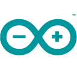

# Hi 👋! My name is Jose Luiz Bruiani Barco and I'm a Fullstack Developer

## Technologies that I use in my daily life

## About Me

### Contact

## Accounts

This is my second account.

My first account is @JLBBARCO.
